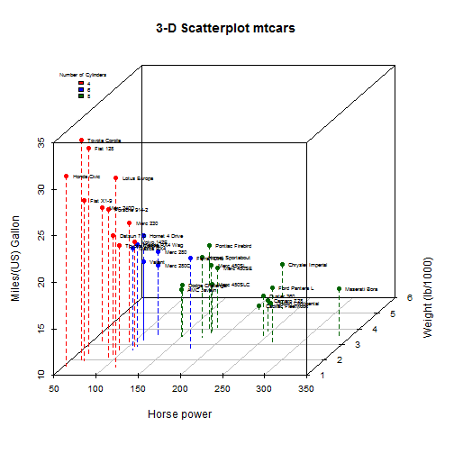

## Synopsis

The present application is using a linear model with horsepower, number of cylinders, and weight as input parameter
and uses the inputed values to predict the miles per gallon of a vehicle having such characteristics. Please, note that 
inputed weight is converted dividing it by 1000 to comply with mtacars dataset requirements. The choice on cylinder number is likewise limited via radio button to the choices allowed by mtcars dataset (4, 6 or 8).

Part1: Shiny Application

* URL: https://coursera-data-products.shinyapps.io/Developing-Data-Products-shiny-and-slidify--master/ 
* A shiny-App detailing the effect of horsepower, number of cylinders, and weight on miles per gallon of a vehicle. 

--- .class #id 

## mtcars dataset - Description

### Motor Trend magazine (Car Road Tests)

The data was extracted from the 1974 Motor Trend US magazine, and comprises fuel consumption and 10 aspects of automobile design and performance for 32 different automobiles (1973-74 models).


```r
library(datasets)
head(mtcars, 3)
```

```
##                mpg cyl disp  hp drat    wt  qsec vs am gear carb
## Mazda RX4     21.0   6  160 110 3.90 2.620 16.46  0  1    4    4
## Mazda RX4 Wag 21.0   6  160 110 3.90 2.875 17.02  0  1    4    4
## Datsun 710    22.8   4  108  93 3.85 2.320 18.61  1  1    4    1
```

--- .class #id

## Features

* The application predict MPG basing upon input variables:
  * Horse Powers
  * Weight
  * Number of cylinders
* The variables are visualized using a 3D scatterplot
* User can change the input variables and verify the predicted MPG as well as the relative position of his input in the 3D scatterplot

--- .class #id

## Sample 3D Plot showing the relationship between variables 




